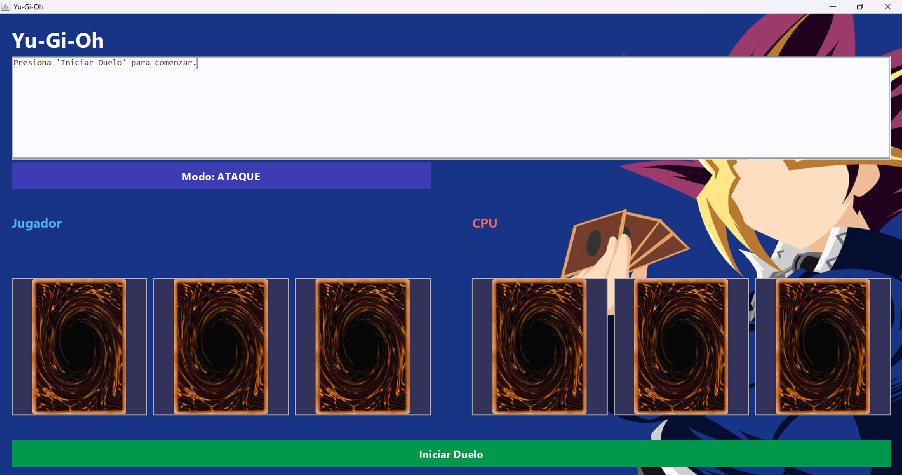
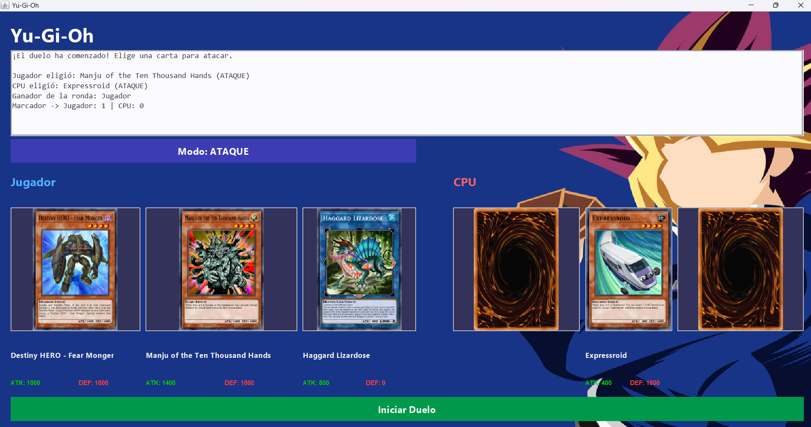
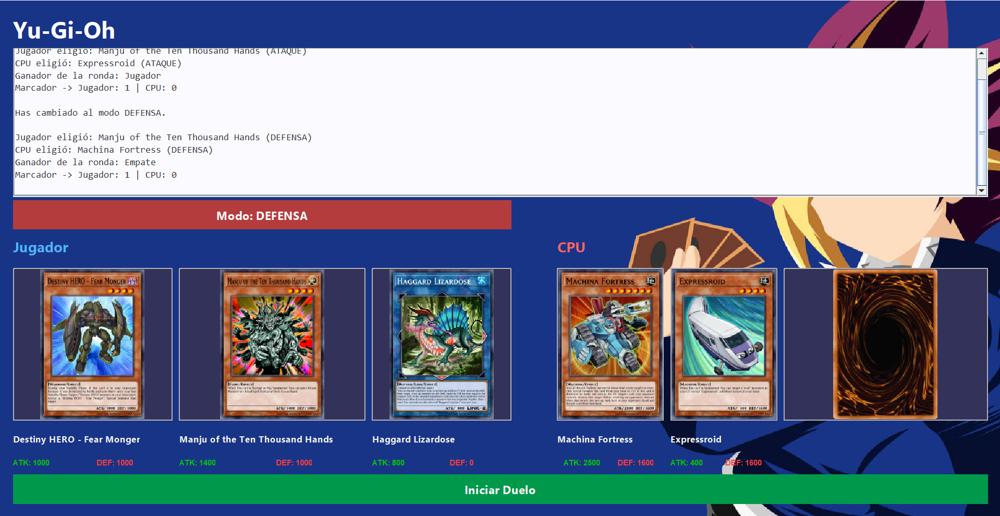
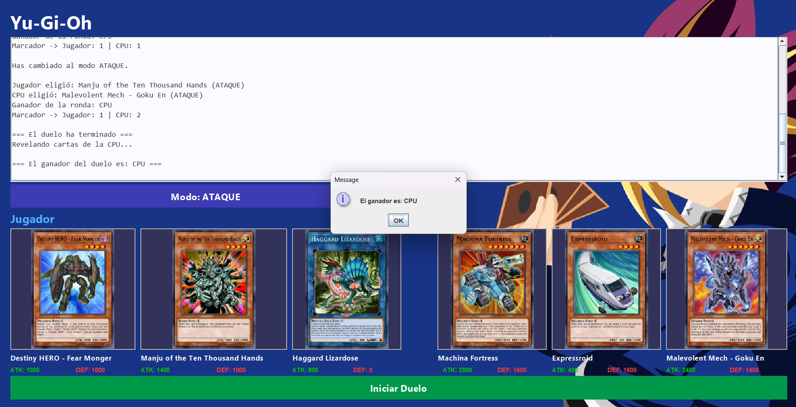

# Lab-Yu-Gi-Oh
## Juan Diego Ospina 2359486
## Mauricio Alejandro Rojas 2359701

# Reglas del juego
1. Cada jugador empieza con 3 cartas.
2. El objetivo es llegar a dos puntos.
3. Cada carta tiene **Ataque** y **Defensa**.
4. En cada turno, un jugador puede:
   - Atacar con una carta.
   - Defenderse con una carta.
5. Si el ataque es mayor que la defensa, el atacante gana un punto.
6. Si las dos cartas estan en defensa es empate y ninguna gana punto.
7. Si los dos estan en ataque gana el que tenga mayor ataque.

# Cómo jugar
Cuando se inicie el juego saldra una pantalla inicial con 6 cartas sin cargar, se debera darle al boton de iniciar duelo para cargar las cartas, estas no se podran
seleccionar hasta que no esten cargadas todas las cartas en total, las cartas de la cpu estaran ocultas y estas solo se van a mostrar cuando
la cpu haya seleccionado su carta, el jugador podra poner en modo ataque o defensa segun quiera y ya luego selecciona la carta que quiere tirar,
en caso de la cpu el ataque o defensa sera aleatorio e igual que la carta seleccionada, en este caso se podran repetir cartas.

Luego se evaluara dependiendo del modo seleccionado por ambos se dara el punto correspondiente o el empate, cuando llegue a dos puntos saldra una
alerta con el ganador, tambein se reveleran las cartas de la cpu y estos datos estaran en un text area con scroll para que vean en tiempo real los datos y las cartas seleccionadas con sus respectivos modos, 
para reiniciar el juego se debera volver a presionar el boton de iniciar duelo.

# Diseño (MVC) Modelo-Vista-Controlador

Ya que utilizamos un modelo llamado *Card* para representar las cartas con sus atributos que son, el nombre, ataque, defensa e imagen, 
la logica del juego esta en la clase *Duel* aqui estara todo lo que tenga que ver con los puntos, la comparacion de los atributos de las cartas, la eleccion de cartas
y el resultado del duelo y por ultimo la vista en la clase *YuGiOhView* que implementamos con Swing, aqui estara todo lo que tenga que ver con la interfaz grafica y la interaccion del usuario.

# Capturas

## Pantalla inicial

## Pantalla de juego en modo ataque y defensa

## Pantalla de ganador

